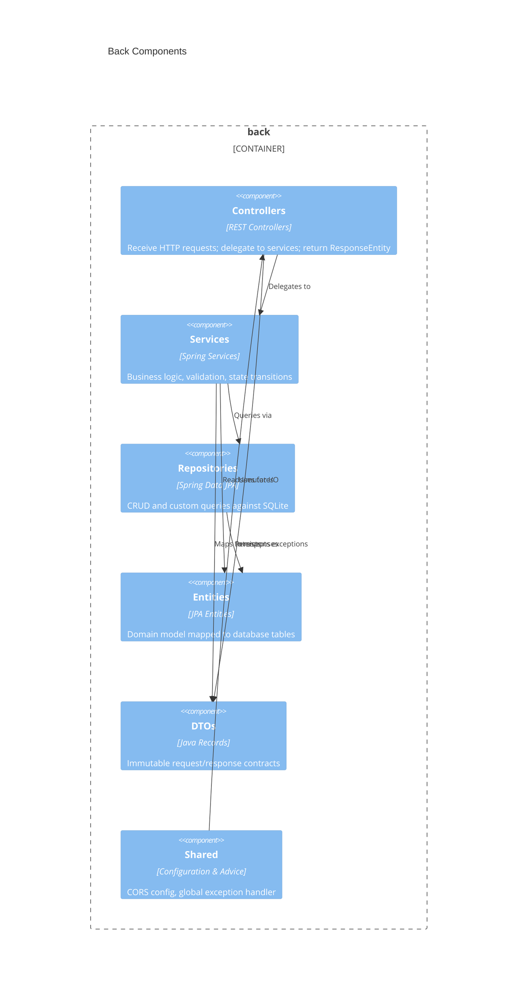

# Back architecture — AstroBookings

> Container `back` from [`system.arch.md`](./system.arch.md). Tier: `back`.

## Overview

The `back` container is a Spring Boot 3.5 REST API running on Java 21. It owns all business logic, validation, and persistence for AstroBookings. Entities are stored in an embedded SQLite database via Spring Data JPA. The API is consumed by the `front` SPA and the `e2e` test suite over HTTP/JSON.

- **Folder**: `back/`
- **Archetype**: Java 21 — Spring Boot 3.5 + Spring Data JPA
- **Talks to**: `db` (SQLite via JDBC/JPA)
- **Consumed by**: `front` (React SPA), `e2e` (Playwright)

---

## Components diagram (C4 L3)



### Code organization

**Pattern**: Feature-based.

```text
back/src/main/java/dev/aiddbot/abjavareact/
├── AbJavaReactApplication.java    # Spring Boot entry point
├── health/                        # Health probe feature
│   ├── HealthCheck.java           # Entity
│   ├── HealthCheckRepository.java # Repository
│   ├── HealthService.java         # Service
│   ├── HealthResponse.java        # Response DTO (record)
│   └── HealthController.java      # Controller
├── rocket/                        # Rockets feature
│   ├── Rocket.java                # Entity
│   ├── RocketRepository.java      # Repository
│   ├── RocketService.java         # Service
│   ├── RocketRequest.java         # Request DTO (record)
│   ├── RocketResponse.java        # Response DTO (record)
│   ├── RocketController.java      # Controller
│   └── RocketNotFoundException.java
├── launch/                        # Launches feature
│   ├── Launch.java                # Entity
│   ├── LaunchRepository.java      # Repository
│   ├── LaunchService.java         # Service
│   ├── LaunchRequest.java         # Request DTO (record)
│   ├── LaunchResponse.java        # Response DTO (record)
│   ├── LaunchController.java      # Controller
│   └── LaunchNotFoundException.java
└── shared/
    ├── CorsConfig.java            # CORS for /api/**
    └── GlobalExceptionHandler.java # @RestControllerAdvice
```

### Key contracts

| Contract | Shape | Direction |
|----------|-------|-----------|
| `GET /api/health` | `→ HealthResponse` | exposes |
| `GET /api/rockets` | `→ List<RocketResponse>` | exposes |
| `POST /api/rockets` | `RocketRequest → RocketResponse (201)` | exposes |
| `PUT /api/rockets/{id}` | `RocketRequest → RocketResponse` | exposes |
| `DELETE /api/rockets/{id}` | `→ 204 No Content` | exposes |
| `GET /api/launches` | `→ List<LaunchResponse>` | exposes |
| `POST /api/launches` | `LaunchRequest → LaunchResponse (201)` | exposes |
| `PUT /api/launches/{id}` | `LaunchRequest → LaunchResponse` | exposes |
| `POST /api/launches/{id}/confirm` | `→ LaunchResponse` | exposes |
| `POST /api/launches/{id}/cancel` | `→ LaunchResponse` | exposes |

---

## Data Schemas

### Tables

| Table | Column | Type | Constraints |
|-------|--------|------|-------------|
| `health_check` | `id` | BIGINT | PK, auto-generated |
| | `status` | VARCHAR | |
| | `database_status` | VARCHAR | |
| | `uptime_seconds` | BIGINT | |
| | `checked_at` | VARCHAR | |
| `rocket` | `id` | VARCHAR | PK, UUID |
| | `name` | VARCHAR | UNIQUE, NOT NULL |
| | `capacity` | INT | 1–9 |
| | `range` | VARCHAR | `Earth \| Moon \| Mars` |
| `launch` | `id` | VARCHAR | PK, UUID |
| | `rocket_id` | VARCHAR | FK → rocket.id |
| | `scheduled_at` | DATETIME | must be future on create/update |
| | `price_per_ticket` | DECIMAL | > 0 |
| | `minimum_occupancy` | INT | > 0 and ≤ rocket.capacity |
| | `status` | VARCHAR | `created \| confirmed \| cancelled \| completed` |

### Launch status transitions

```
created ──confirm──→ confirmed
created ──cancel──→ cancelled
confirmed ──cancel──→ cancelled
completed / cancelled  (terminal — no transitions allowed)
```

> last updated: 2026-06-09
