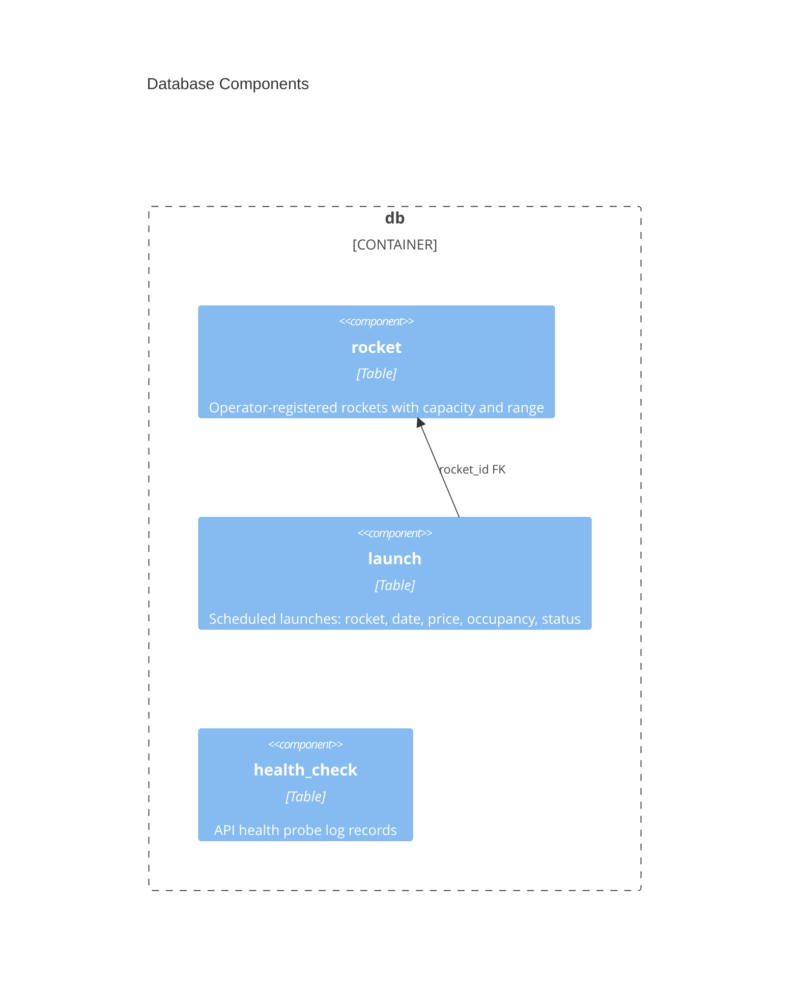

# Database architecture — AstroBookings

> Container `db` from [`system.arch.md`](./system.arch.md). Tier: `db`.

## Overview

The `db` container is an embedded SQLite file database (`data/app.db`), created and migrated automatically by Hibernate JPA from entity definitions in the `back` container. It persists all domain data: rockets, launches, and health-check records. There are no standalone DDL or migration files — the schema lives entirely in JPA `@Entity` classes.

- **Folder**: `data/` (runtime-generated, not in source control)
- **Archetype**: SQLite — embedded file database
- **Talks to**: `back` (via JDBC / Spring Data JPA, `jdbc:sqlite:data/app.db`)

---

## Components diagram (C4 L3)



### Code organization

**Pattern**: Schemeless — DDL generated by Hibernate (`ddl-auto: update`) from JPA `@Entity` classes in `back/`.

```text
data/
└── app.db                                          # SQLite file — auto-created at backend startup

back/src/main/java/…/
├── rocket/Rocket.java                              # defines table: rocket
├── launch/Launch.java                              # defines table: launch
└── health/HealthCheck.java                         # defines table: health_check
```

### Key contracts

| Contract | Shape | Direction |
|----------|-------|-----------|
| JDBC URL | `jdbc:sqlite:data/app.db` | consumed by `back` |
| DDL strategy | `hibernate.ddl-auto: update` | managed by `back` on startup |
| Dialect | `SQLiteDialect` (Hibernate Community) | configured in `back` |

---

## Data Schemas

### `rocket`

| Column | Type | Constraints |
|--------|------|-------------|
| `id` | TEXT | PK, UUID auto-generated |
| `name` | TEXT | NOT NULL, UNIQUE |
| `capacity` | INTEGER | NOT NULL |
| `range_of_action` | TEXT | NOT NULL |

### `launch`

| Column | Type | Constraints |
|--------|------|-------------|
| `id` | TEXT | PK, UUID auto-generated |
| `rocket_id` | TEXT | NOT NULL, FK → `rocket.id` |
| `scheduled_at` | TEXT | NOT NULL (ISO-8601 datetime) |
| `price_per_ticket` | NUMERIC | NOT NULL |
| `minimum_occupancy` | INTEGER | NOT NULL |
| `status` | TEXT | NOT NULL, default `'created'` |

### `health_check`

| Column | Type | Constraints |
|--------|------|-------------|
| `id` | INTEGER | PK, auto-increment |
| `status` | TEXT | NOT NULL |
| `database_status` | TEXT | NOT NULL |
| `uptime_seconds` | INTEGER | NOT NULL |
| `checked_at` | TEXT | NOT NULL |

> last updated: 2026-06-09
