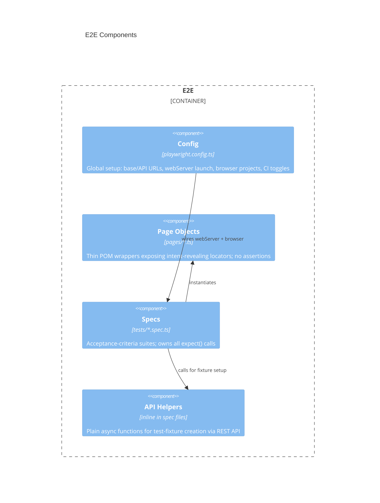

# E2E architecture — AstroBookings

> Container `e2e` from [`system.arch.md`](./system.arch.md). Tier: `e2e`.

## Overview

The `e2e` container is a Playwright-based end-to-end test suite that verifies the full AstroBookings stack by driving a real browser against the running SPA and calling the REST API directly for test-fixture setup. It uses the Page Object Model (POM) for reusable UI interactions and inline locators with API helpers for feature-specific flows.

- **Folder**: `e2e/`
- **Archetype**: TypeScript (ESM) — Playwright Test 1.52
- **Talks to**: `front` (browser-driven via Playwright), `back` (API calls via `APIRequestContext`)

---

## Components diagram (C4 L3)



### Code organization

**Pattern**: Flat feature-per-spec + shared POM layer.

```text
e2e/
├── playwright.config.ts   # global config: base URL, API URL, webServer, browser projects
├── pages/                 # Page Object Model wrappers (locators only, no assertions)
│   └── HealthPage.ts      # locators for the SPA health view
└── tests/                 # one spec per domain feature
    ├── health.spec.ts     # health check acceptance criteria (4 tests)
    └── bookings.spec.ts   # bookings acceptance criteria (9 tests, serial mode)
```

### Key contracts

| Contract | Shape | Direction |
|----------|-------|-----------|
| Front SPA | `baseURL` → `http://localhost:5173` (env: `E2E_BASE_URL`) | consumes |
| Back health | `GET /api/health` | consumes |
| Back rockets | `POST /api/rockets` | consumes (fixture) |
| Back launches | `POST /api/launches`, `POST /api/launches/{id}/confirm` | consumes (fixture) |
| Back bookings | `POST /api/bookings`, `POST /api/bookings/{id}/cancel` | consumes (fixture + assertion) |

---

## Data Schemas

N/A — this container owns no persistent schema. All data is created and read via the `back` REST API during test runs.

> last updated: 2026-06-11
