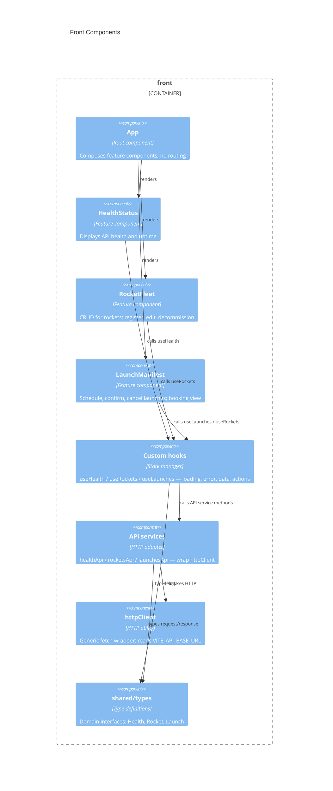

# Front architecture — AstroBookings

> Container `front` from [`system.arch.md`](./system.arch.md). Tier: `front`.

## Overview

The `front` container is a React 19 + TypeScript SPA built with Vite. It provides the full UI for operators (manage rockets and launches) and passengers (browse and book confirmed launches). All backend communication goes through a fetch-based HTTP client proxied to the `back` container at port 8080.

- **Folder**: `front/`
- **Archetype**: TypeScript — React 19 + Vite
- **Talks to**: `back` (HTTP/JSON REST at `/api`)

---

## Components diagram (C4 L3)



### Code organization

**Pattern**: Feature-based with shared infrastructure.

```text
front/src/
├── main.tsx              # React root — StrictMode mount
├── App.tsx               # Root composition — renders three feature components
├── index.css             # Global design tokens (CSS custom properties, dark theme)
├── shared/
│   ├── api/
│   │   └── httpClient.ts # Generic fetch wrapper — get/post/put/del
│   └── types/
│       ├── health.ts     # Health domain interfaces
│       ├── rocket.ts     # Rocket + RocketRequest interfaces
│       └── launch.ts     # Launch + LaunchRequest interfaces + LaunchStatus union
└── features/
    ├── health/           # Read-only system status
    │   ├── HealthStatus.tsx
    │   ├── useHealth.ts
    │   ├── healthApi.ts
    │   └── HealthStatus.test.tsx / useHealth.test.ts / healthApi.test.ts
    ├── rockets/          # Rocket fleet CRUD
    │   ├── RocketFleet.tsx
    │   ├── useRockets.ts
    │   ├── rocketsApi.ts
    │   └── *.test.{ts,tsx}
    └── launches/         # Launch scheduling + booking view
        ├── LaunchManifest.tsx
        ├── useLaunches.ts
        ├── launchesApi.ts
        └── *.test.{ts,tsx}
```

### Key contracts

| Contract | Shape | Direction |
|----------|-------|-----------|
| `GET /api/health` | `HealthResponse` | consumes |
| `GET /api/rockets` | `Rocket[]` | consumes |
| `POST /api/rockets` | body: `RocketRequest` → `Rocket` | consumes |
| `PUT /api/rockets/:id` | body: `RocketRequest` → `Rocket` | consumes |
| `DELETE /api/rockets/:id` | `void` | consumes |
| `GET /api/launches` | `Launch[]` | consumes |
| `POST /api/launches` | body: `LaunchRequest` → `Launch` | consumes |
| `PUT /api/launches/:id` | body: `LaunchRequest` → `Launch` | consumes |
| `PATCH /api/launches/:id/confirm` | `void` | consumes |
| `PATCH /api/launches/:id/cancel` | `void` | consumes |
| `useRockets()` | `{ rockets, error, isLoading, create, update, decommission }` | exposes (hook) |
| `useLaunches()` | `{ launches, error, isLoading, schedule, update, confirm, cancel }` | exposes (hook) |

---

## Data Schemas

### Domain types (`shared/types/`)

```typescript
// rocket.ts
type Range = 'Earth' | 'Moon' | 'Mars';
interface Rocket   { id: string; name: string; capacity: number; range: Range; }
interface RocketRequest { name: string; capacity: number; range: Range; }

// launch.ts
type LaunchStatus = 'created' | 'confirmed' | 'completed' | 'cancelled';
interface Launch  { id: string; rocketId: string; rocketName: string; scheduledAt: string;
                    pricePerTicket: number; minimumOccupancy: number; status: LaunchStatus; }
interface LaunchRequest { rocketId: string; scheduledAt: string;
                          pricePerTicket: number; minimumOccupancy: number; }

// health.ts
type Status = 'UP' | 'DOWN';
interface HealthResponse { status: Status; database: Status;
                           uptime: { seconds: number }; timestamp: string; }
```

> last updated: 2026-06-09
