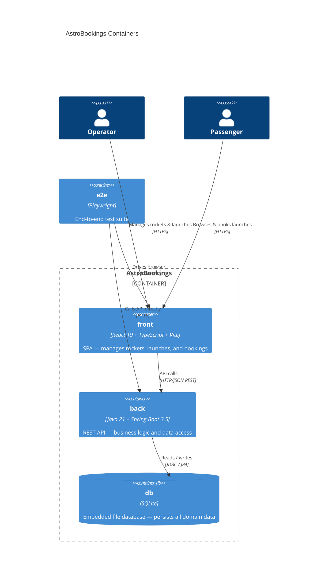
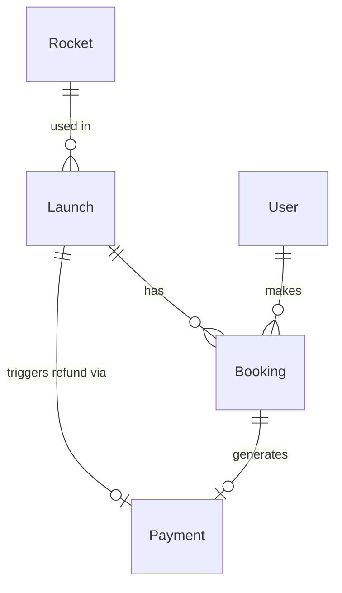

# System architecture — AstroBookings

## Overview

AstroBookings is a fictional space travel booking system. Operators manage a fleet of rockets and schedule launches with seat pricing and occupancy rules. Passengers browse launches and make bookings. Payments and refunds flow through a mock transactional gateway. The system comprises a Spring Boot REST API, a React SPA, and a Playwright e2e suite.

---

## Containers diagram

### Containers table
| Container | Technology | Responsibility |
|-----------|------------|----------------|
| [front](./../front.arch.md) | React 19, TypeScript, Vite | SPA — rockets, launches, bookings UI |
| [back](./back.arch.md) | Java 21, Spring Boot 3.5, Spring Data JPA | REST API — business logic, data access |
| [db](./../db.arch.md) | SQLite (embedded) | Persistent file-based data store |
| [e2e](./../e2e.arch.md) | Playwright | End-to-end browser test suite |

---

## Entity-Relationship diagram

> Canonical, system-wide entity model. Specs reference a feature subset; container docs add physical schemas.

---

> last updated: 2026-06-09
