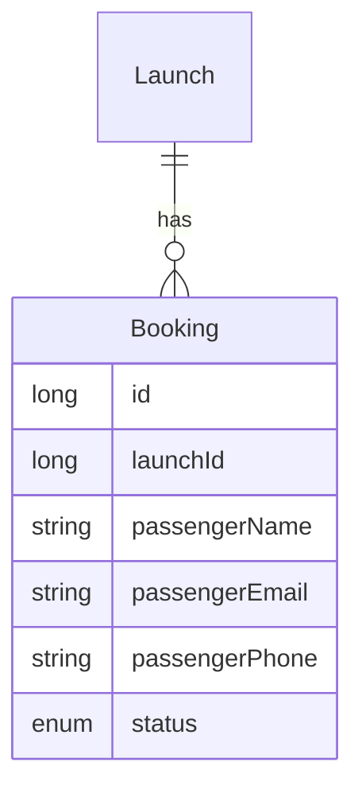

# Specification — Bookings management

## Problem definition

Passengers need to reserve seats on scheduled rocket launches and be able to cancel those reservations. Operators need visibility into who has booked each launch. The system must capture enough passenger contact information (name, email, phone) to support downstream communication and payment flows.

### User Stories

- As a **passenger**, I want to **book a seat on a launch** so that I have a guaranteed place on the mission.
- As a **passenger**, I want to **provide my name, email, and phone number** when booking so that the operator can contact me.
- As a **passenger**, I want to **cancel a booking I created** so that I can free my seat if my plans change.
- As a **passenger**, I want to **view all my bookings and their status** so that I know the state of my reservations.
- As an **operator**, I want to **see all bookings for a launch** so that I know the passenger manifest and occupancy.

### Business rules

- A booking is always associated with an existing launch and a passenger.
- A booking requires a passenger name, a valid email address, and a phone number.
- A booking is created with status **created**.
- Only a booking with status **created** may be cancelled; it then transitions to **cancelled**.
- Cancelling a booking does not delete the record — the history is preserved.
- A passenger may not book the same launch more than once (duplicate check by email + launch).

---

## Solution overview

> Expected results only — outcomes, not implementation. `/planify` turns these into steps per container.

### Data Model

> `status` values: `CREATED`, `CANCELLED`.

---

### back

The API must expose booking operations so the SPA can create, cancel, and list bookings.

- Accepts a request to create a booking for a given launch, storing passenger name, email, and phone; returns the new booking with its generated id and `CREATED` status.
- Rejects duplicate bookings (same email + same launch) with a clear error.
- Accepts a cancellation request for an existing booking and transitions its status to `CANCELLED`; rejects requests to cancel an already-cancelled booking.
- Returns the list of all bookings for a given launch (operator view).
- Returns the list of all bookings for a given passenger email (passenger view).

### front

The SPA must let passengers and operators interact with bookings through the UI.

- Shows a **Book this launch** action on the launch detail page; opens a form to enter passenger name, email, and phone.
- Submits the booking form and displays the confirmed booking with its status.
- Shows a **My bookings** view where a passenger can see all their reservations and their statuses.
- Allows a passenger to cancel a booking that has status `CREATED`; the status updates to `CANCELLED` in the UI immediately.
- Shows the passenger manifest (booking list) on the launch detail page for operators.

### db

The database must persist booking records with all required fields and support the queries needed by the API.

- Stores each booking with its launch reference, passenger details (name, email, phone), and status.
- Enforces the uniqueness constraint on (launch, passenger email).
- Retains cancelled bookings (no hard deletes).

---

## Verification

### Acceptance criteria

- [x] When a passenger submits a valid booking form, the system creates a booking with status `CREATED` and returns it.
- [x] When a passenger attempts to book the same launch twice with the same email, the system rejects the second request with an error.
- [x] When a passenger cancels a `CREATED` booking, the system updates its status to `CANCELLED`.
- [x] When a passenger attempts to cancel a `CANCELLED` booking, the system rejects the request with an error.
- [x] When an operator views a launch, the system displays all bookings for that launch with passenger details and statuses.
- [x] When a passenger views their bookings, the system lists all their reservations across all launches.

### Additional criteria

- [x] Booking form validates that name, email, and phone are present before submission.
- [x] Email field is validated as a properly formatted email address.
- [x] Cancelled bookings remain visible in the passenger's booking list with a `CANCELLED` label.
