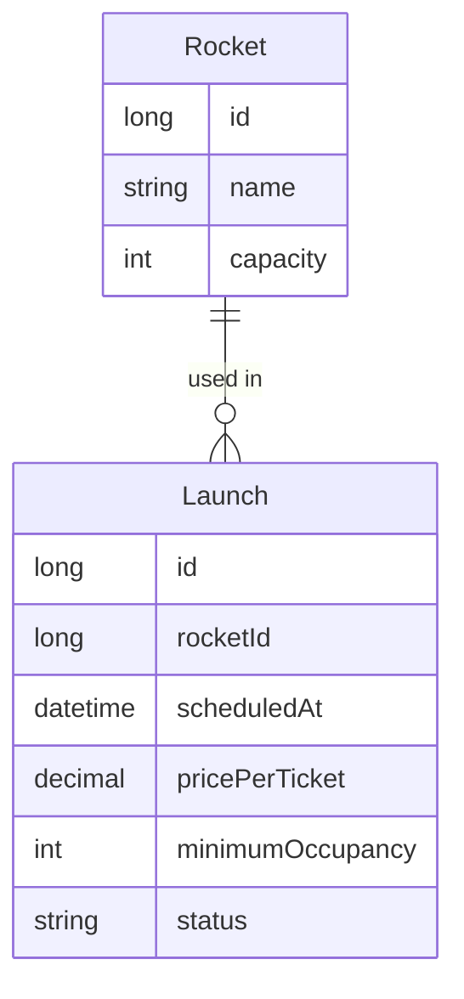

# Specification — Launches

## Problem definition

Space travel operators need to schedule rocket launches with seat pricing and occupancy rules so that passengers can browse and book available flights. Without a structured launch management system, operators cannot control capacity, pricing, or launch lifecycle.

### User Stories

- As an operator, I want to **create a launch** assigned to a rocket so that passengers can see and book it.
- As an operator, I want to **set the launch time, price per ticket, and minimum occupancy** so that the business conditions are clearly defined.
- As an operator, I want to **view all launches and their current status** so that I can monitor the schedule.
- As an operator, I want to **confirm a launch** once minimum occupancy is met so that it proceeds to execution.
- As an operator, I want to **cancel a launch** when needed so that affected bookings can be refunded.
- As a passenger, I want to **browse available launches** so that I can choose one to book.

### Business rules

- A launch must be linked to exactly one rocket.
- Launch time must be in the future at creation.
- Price per ticket must be greater than zero.
- Minimum occupancy must be greater than zero and not exceed the rocket's seat capacity.
- Valid status transitions: `created` → `confirmed` → `completed` or `cancelled`.
- A launch in `completed` or `cancelled` status cannot be modified.
- Cancelling a launch triggers refunds for all associated bookings.

## Solution overview

> Expected results only — outcomes, not implementation. `/planify` turns these into steps per container.

### Data Model

### back

The REST API must store and manage launches with full lifecycle support.

- Operators can create a launch by supplying a rocket reference, scheduled time, price per ticket, and minimum occupancy.
- The API exposes a list of all launches with their current status.
- Operators can update a launch's details while it is in `created` status.
- Operators can transition a launch from `created` to `confirmed`.
- Operators can cancel a launch in `created` or `confirmed` status.
- Invalid status transitions are rejected with a clear error response.

### front

The SPA must give operators a clear interface to manage launches and let passengers browse them.

- Operators see a launch list showing rocket name, scheduled time, price, minimum occupancy, and current status.
- Operators can create a new launch using a form that validates required fields.
- Operators can view the detail of a launch and trigger status changes (confirm, cancel).
- Passengers see a read-only list of launches in `confirmed` status available for booking.

### db

The database must persist all launch data reliably.

- A `launches` table stores each launch with its rocket reference, time, pricing, occupancy threshold, and status.
- Referential integrity is enforced between launches and rockets.

## Verification

### Acceptance criteria

- [ ] When an operator creates a launch with valid data, the system saves it with `created` status.
- [ ] When an operator submits a launch with a past date, the system rejects it with a validation error.
- [ ] When an operator submits a price of zero or less, the system rejects it with a validation error.
- [ ] When an operator confirms a launch, the status changes from `created` to `confirmed`.
- [ ] When an operator cancels a launch, the status changes to `cancelled` and all bookings are flagged for refund.
- [ ] When a passenger views available launches, only `confirmed` launches are displayed.
- [ ] When an operator attempts an invalid status transition, the system returns an error.

### Additional criteria

- [ ] Status transitions outside the allowed sequence are blocked.
- [ ] A launch cannot reference a non-existent rocket.
- [ ] Minimum occupancy cannot exceed the assigned rocket's seat capacity.
